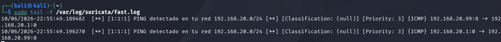

# Proyecto Suricata IDS - Red 192.168.20.0/24

Configuración de IDS con Suricata en Kali.

**HOME_NET:** 192.168.20.0/24
**IP Kali:** 192.168.20.99
**IP Víctima:** 192.168.20.1

**Regla:**
`alert icmp any any -> $HOME_NET any (msg:"PING detectado"; itype:8; sid:1;)`

## Evidencia

Log detectado en `/var/log/suricata/fast.log`
